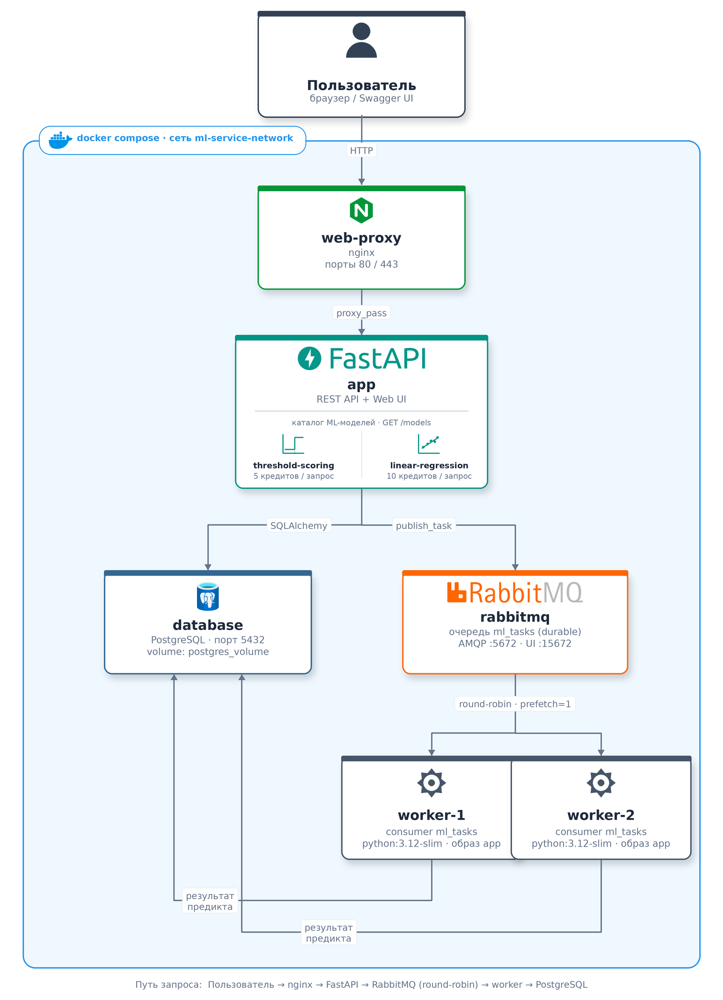
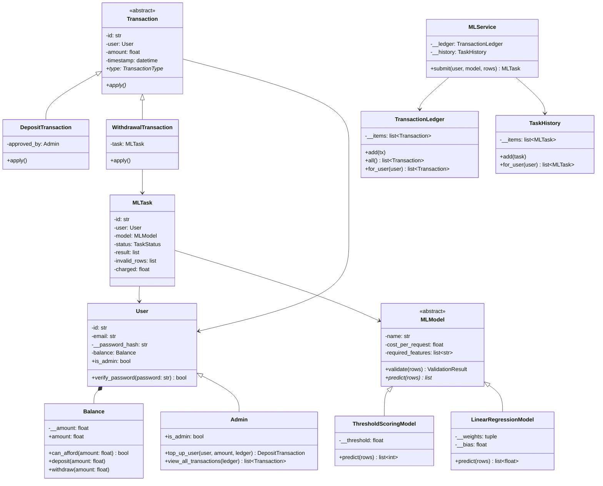

# ML-сервис с биллингом

Личный кабинет ML-сервиса: пользователи, баланс в условных кредитах,
транзакции, ML-модели, задачи предсказания и их история.

## Структура проекта

```
project-root/
├── app/                      # backend-приложение
│   ├── src/
│   │   ├── main.py           # FastAPI: роутеры API, /health, /models, обработчики ошибок
│   │   ├── domain.py         # объектная модель сервиса (этап 1)
│   │   ├── demo.py           # демо-сценарий работы модели
│   │   ├── database.py       # подключение к БД (SQLAlchemy, DATABASE_URL из env)
│   │   ├── db_models.py      # ORM-модели: users, balances, transactions, ml_models, ml_tasks, access_tokens
│   │   ├── services.py       # бизнес-операции: пользователи, баланс, предикты, токены
│   │   ├── schemas.py        # Pydantic-схемы запросов и ответов API (этап 4)
│   │   ├── security.py       # bearer-аутентификация, зависимость get_current_user
│   │   ├── routers/          # эндпоинты: auth, users, balance, predict, history, admin, web
│   │   ├── templates/        # HTML-страницы личного кабинета (этап 6)
│   │   ├── static/           # style.css и app.js — клиент REST API (этап 6)
│   │   ├── mq.py             # публикация задач в очередь RabbitMQ (publisher, этап 5)
│   │   ├── worker.py         # ML-воркер: consumer очереди (этап 5)
│   │   ├── init_db.py        # идемпотентная инициализация БД и демо-данных
│   │   └── tests/            # pytest-тесты: БД (этап 3), REST API (этап 4),
│   │                         # web (этап 6), сквозной сценарий (этап 7)
│   ├── Dockerfile
│   ├── requirements.txt
│   └── .env                  # конфигурация приложения
├── web-proxy/                # reverse proxy
│   ├── nginx.conf
│   └── Dockerfile
├── scripts/
│   └── smoke_test.py         # смоук-проверка развёрнутой системы по HTTP (этап 7)
├── docs/
│   └── architecture-diagram.png  # схема взаимодействия сервисов (см. ниже)
├── .env.example              # шаблон корневого .env (переменные для database)
├── docker-compose.yml        # 4 сервиса: app, web-proxy, rabbitmq, database
├── TESTING.md                # отчёт о тестировании работоспособности (этап 7)
└── README.md
```

## Запуск

```bash
cp .env.example .env       # один раз: корневой .env со значениями POSTGRES_*
docker compose up --build
```

Корневой `.env` не хранится в репозитории (см. `.gitignore`) — значения из
него подставляются в сервис `database` через `${...}` в `docker-compose.yml`.

После запуска:

- http://localhost — приложение через nginx (порты 80/443)
- http://localhost:15672 — RabbitMQ management UI (guest/guest)
- PostgreSQL — порт 5432 внутри сети `ml-service-network`

Проверка без Docker:

```bash
cd app/src && python demo.py       # демо объектной модели
```

## Архитектура сервисов

| Сервис | Образ | Назначение |
|---|---|---|
| `app` | python:3.12-slim (свой Dockerfile) | FastAPI-приложение; конфиг через `env_file`, исходники через `volumes`, портов наружу нет — доступ только через proxy |
| `web-proxy` | nginx:latest | Reverse proxy; `depends_on: app`, наружу порты 80 и 443 |
| `rabbitmq` | rabbitmq:3-management | Брокер сообщений; порты 5672 (AMQP) и 15672 (UI); данные очередей в named volume `rabbitmq_volume`; `restart: on-failure` — автоперезапуск при сбоях |
| `database` | postgres:16 | БД; конфиг через `${POSTGRES_*}` из корневого `.env` (секретов в docker-compose.yml нет); данные в named volume `postgres_volume` — переживают удаление контейнера и директории проекта |
| `worker` ×2 | образ app | ML-воркеры (этап 5): consumers очереди `ml_tasks`, `deploy.replicas: 2`, `restart: on-failure` |

Все сервисы объединены bridge-сетью `ml-service-network` и общаются по
именам сервисов (например, `app` подключается к базе по хосту `database`).

### Схема взаимодействия



Путь одного ML-запроса: браузер обращается к `app` только через
`web-proxy` (наружу открыты порты только у него); `app` сразу пишет задачу
в `database` со статусом `new` и публикует сообщение в `rabbitmq`; один из
двух воркеров забирает сообщение (RabbitMQ распределяет их по кругу,
`prefetch_count=1` не даёт воркеру взять вторую задачу, не подтвердив
первую) и пишет результат обратно в `database`; клиент видит готовый
результат через `GET /predict/{task_id}`, опрашивая тот же `app`.
Асинхронная обработка и её надёжность подробнее разобраны в разделе
[этапа 5](#асинхронная-обработка-через-rabbitmq-этап-5).

## Объектная модель (этап 1)

Модель находится в `app/src/domain.py`, демо-сценарий — `app/src/demo.py`.

| Класс | Назначение |
|---|---|
| `Balance` | Счёт в условных кредитах: инкапсулирует сумму и инварианты (не может уйти в минус), изменения только через `deposit()`/`withdraw()` |
| `User` / `Admin` | Пользователь и администратор (наследование). Владеет счётом `Balance` (композиция), но не управляет им; хэш пароля — приватное поле |
| `Transaction` (ABC) → `DepositTransaction`, `WithdrawalTransaction` | Пополнение и списание; полиморфный `apply()` |
| `TransactionLedger` | История транзакций, выборка по пользователю |
| `MLModel` (ABC) → `ThresholdScoringModel`, `LinearRegressionModel` | Модели с единым интерфейсом `validate()` / `predict()` и стоимостью запроса |
| `MLTask`, `TaskHistory` | Задача для модели со статусом, результатом, ошибочными строками и суммой списания |
| `MLService` | Оркестратор: проверка баланса → валидация → предикт → списание при успехе |

## Диаграмма классов



## Принципы ООП

**Инкапсуляция.** Сумма счёта (`Balance.__amount`) и хэш пароля — приватные;
изменение баланса возможно только через `Balance.deposit()`/`Balance.withdraw()`,
которые вызываются транзакциями (`Transaction.apply()`) и защищают инвариант
неотрицательности. Внутренние списки историй закрыты, наружу отдаются копии.
Состояние `MLTask` меняется только методами оркестратора.

**Разделение ответственности (SRP).** Управление балансом — не зона
ответственности пользователя: `User` лишь владеет счётом (композиция
`User *-- Balance`), а правила операций инкапсулированы в самой сущности
`Balance`.

**Наследование.** `Admin` расширяет `User` (пополнение баланса другим
пользователям, просмотр всех транзакций); конкретные транзакции и модели
расширяют абстрактные `Transaction` и `MLModel`.

**Полиморфизм.** `MLService` вызывает `model.predict()` и `tx.apply()`, не зная
конкретного класса; `Admin.is_admin` переопределяет свойство базового класса.

## Бизнес-правила

- Запрос отклоняется при недостаточном балансе (`InsufficientBalanceError`) —
  проверка до выполнения.
- Ошибочные строки выборки возвращаются пользователю, предсказание выполняется
  над валидными. Валидация построчная: пропущенный признак или нечисловое
  значение отклоняют только свою строку (с причиной в `invalid_rows`), а не
  всю выборку — поэтому `PredictRequest.rows` принимает значения как `Any`,
  а разбор выполняет `MLModel.validate()`.
- Кредиты списываются только при успешном выполнении предсказания.

## База данных и ORM (этап 3)

Объектная модель этапа 1 отображена на PostgreSQL через SQLAlchemy 2.0.

| Сущность domain.py | Таблица | Связи |
|---|---|---|
| `User` / `Admin` | `users` | наследование свёрнуто во флаг `is_admin` |
| `Balance` | `balances` | 1:1 c `users` (FK + UNIQUE), CHECK `amount >= 0` |
| `Transaction` (deposit/withdrawal) | `transactions` | FK на `users`, `ml_tasks` (списание) и `users` (одобривший админ) |
| `MLModel` и наследники | `ml_models` | параметры в БД, реализации predict — в `domain.py` |
| `MLTask` / `TaskHistory` | `ml_tasks` | FK на `users` и `ml_models`; история запросов |

Бизнес-операции (`services.py`) атомарны: проверка баланса, списание,
запись транзакции и результата выполняются одним коммитом. Правила и
исключения переиспользуются из `domain.py` (`InsufficientBalanceError`,
enum-ы, полиморфный `predict`).

### Инициализация

Выполняется автоматически при старте `app` (lifespan) и идемпотентна —
повторный запуск не дублирует и не сбрасывает данные. Создаёт:

- демо-администратора `admin@ml-service.com` / `admin123`;
- демо-пользователя `demo@ml-service.com` / `demo123` со стартовым
  балансом 100 кредитов (deposit-транзакция, одобренная админом);
- базовые ML-модели `threshold-scoring` (5 кредитов) и
  `linear-regression` (10 кредитов).

Ручной запуск: `docker compose exec app python init_db.py`

### Тесты сценариев

```bash
docker compose exec app pytest -v
```

Тесты работают на собственной базе SQLite (`conftest.py` подменяет
`DATABASE_URL` до импорта приложения), поэтому запуск внутри контейнера
не создаёт учётных записей и транзакций в рабочей базе. Прогнать их на
настоящей СУБД можно явно: `docker compose exec -e TEST_DATABASE_URL=... app pytest`.

Покрыто: создание и загрузка пользователей, связь с балансом, пополнение,
списание с проверкой баланса, запись транзакций, успешный предикт со
списанием, отказ при нехватке кредитов, возврат ошибок валидации без
списания, история предиктов с сортировкой по дате, идемпотентность
инициализации.

## REST API (этап 4)

Интерфейс на FastAPI поверх бизнес-логики `services.py` — контроллеры
(`routers/`) логику не дублируют. Интерактивная документация и ручное
тестирование — Swagger UI: **http://localhost/docs**.

### Аутентификация

Bearer-токен, хранится в таблице `access_tokens` (JWT — на следующих этапах):
`POST /auth/login` возвращает `access_token`, дальше он передаётся в заголовке
`Authorization: Bearer <token>` (в Swagger — кнопка **Authorize**).
Демо-доступ: `demo@ml-service.com` / `demo123` (баланс 100 кредитов),
админ — `admin@ml-service.com` / `admin123`.

### Эндпоинты

| Метод и путь | Описание | Коды ошибок |
|---|---|---|
| `POST /auth/register` | регистрация | 409 email занят, 422 валидация |
| `POST /auth/login` | авторизация, выдача токена | 401 неверные данные |
| `GET /users/me` | текущий пользователь | 401 |
| `GET /balance` | текущий баланс | 401 |
| `POST /balance/top-up` | пополнение, возвращает обновлённый баланс | 401, 422 сумма <= 0 |
| `POST /predict` | поставить задачу в очередь RabbitMQ, вернуть `task_id` (status `new`) | 401, 402 нет кредитов, 404 нет модели, 503 брокер недоступен |
| `GET /predict/{task_id}` | задача по id | 401, 404 (в т.ч. чужая задача) |
| `GET /history/predictions` | история ML-запросов (дата, статус, кредиты) | 401 |
| `GET /history/transactions` | история транзакций | 401 |

Единый формат ошибок: `{"detail": ...}` с корректным HTTP-кодом.
Ответ `/predict` построен вокруг задачи (`task_id`, `status`, `result`);
с этапа 5 обработка асинхронная: POST возвращает статус `new`, а результат
забирается через `GET /predict/{task_id}` после обработки воркером.

### Тесты

```bash
docker compose exec app pytest tests/test_api.py -v   # REST API: коды ответов, аутентификация, ошибки
```

Полный набор проверок и отчёт о тестировании — в разделе
[этапа 7](#тестирование-работоспособности-системы-этап-7).

## Асинхронная обработка через RabbitMQ (этап 5)

Модель publisher → broker → consumers на одной durable-очереди `ml_tasks`
(default exchange). Полный путь задачи:

1. `POST /predict` (publisher): проверка баланса, создание задачи в БД
   (status `new`), публикация JSON-сообщения в очередь, клиенту сразу
   возвращается `task_id`;
2. RabbitMQ раздаёт сообщения воркерам по кругу (round-robin);
   `prefetch_count=1` — воркер не берёт новую задачу, пока не подтвердил
   текущую, поэтому распределение честное;
3. воркер (`worker.py`, 2 экземпляра через `deploy.replicas`): валидация →
   полиморфный предикт → результат в БД напрямую → лог результата → `basic_ack`.

### Резервирование и возврат средств

Стоимость запроса списывается **при постановке задачи** (одним коммитом с
её созданием), поэтому между проверкой баланса и обработкой средства нельзя
потратить параллельным запросом. Если работа не выполнена, резерв
возвращается на баланс отдельной deposit-транзакцией, привязанной к задаче
(видна в истории):

| Ситуация | Результат |
|---|---|
| задачу не удалось опубликовать в очередь | 503, статус `failed`, средства возвращены |
| ошибка предикта в воркере | статус `failed`, средства возвращены |
| данные не прошли валидацию | статус `validation_failed`, средства возвращены |
| успешная обработка | статус `done`, резерв остаётся списанным |

Возврат идемпотентен: признак — обнулённое `task.charged`, повторный вызов
`refund_task()` средств не начисляет.

Сообщение-задача и лог результата — в формате задания:

```json
{"task_id": "uuid", "features": [{"feature_1": 1.0, "feature_2": 1.0}],
 "model": "threshold-scoring", "timestamp": "2026-08-06T12:00:00+00:00"}
```
```json
{"task_id": "uuid", "prediction": [1], "worker_id": "worker-abc123", "status": "done"}
```

Надёжность: очередь durable, сообщения persistent (`delivery_mode=2`),
подтверждение после обработки — при падении воркера задача возвращается в
очередь и достаётся другому; повторная доставка безопасна (задача со
статусом не-`new` не обрабатывается заново).

### Как проверить

```bash
docker compose up -d --build         # поднимет и двух воркеров
docker compose ps                    # ...-worker-1 и ...-worker-2
docker compose logs -f worker        # видно, какой воркер взял какую задачу
```

Через Swagger (/docs): `POST /predict` несколько раз подряд → в логах
воркеров задачи чередуются между `worker_id` (round-robin);
`GET /predict/{task_id}` → статус меняется `new` → `done`, появляется
результат и списание. Очередь видна в management UI:
http://localhost:15672 → Queues → `ml_tasks`.

Проверка отсутствия потерь: `docker compose stop worker` → отправить
несколько задач (в UI очереди растёт Ready) → `docker compose start worker`
→ задачи разобраны, ни одна не потеряна.

## Web-интерфейс личного кабинета (этап 6)

Открывается на **http://localhost/** — страницы отдаёт то же приложение
(Jinja2-шаблоны в `app/src/templates`), а все данные браузер получает из
**существующего REST API** через `fetch` с тем же bearer-токеном, что и
Swagger. Бизнес-логика во фронтенде не дублируется: страницы только
отправляют запросы и отображают ответы, включая ошибки backend.

Стек интерфейса намеренно простой: Jinja2 + ванильный JavaScript + CSS,
без фреймворков, `node_modules` и шага сборки — проект по-прежнему
поднимается одной командой `docker compose up`. Оформление построено на
собственных токенах (`static/style.css`): холодная бумага и чернила,
шрифты IBM Plex в трёх ролях (Serif — заголовки, Sans — текст, Mono —
числа, идентификаторы и подписи), единственный акцент используется на
действиях и активном шаге обработки. Сквозной элемент — «конвейер
задачи» (Запрос → Очередь → Воркер → Результат): на главной он объясняет
архитектуру, в кабинете показывает реальный статус отправленного запроса,
пока страница опрашивает `GET /predict/{task_id}`.

| Страница | Что делает | Используемые эндпоинты |
|---|---|---|
| `/` | описание возможностей сервиса и каталог моделей (без авторизации) | `GET /models` |
| `/register`, `/login` | регистрация и вход, токен сохраняется в браузере | `POST /auth/register`, `POST /auth/login` |
| `/dashboard` | баланс, пополнение, отправка ML-запроса, результат | `GET /users/me`, `GET /balance`, `POST /balance/top-up`, `POST /predict`, `GET /predict/{id}` |
| `/history` | история запросов и транзакций | `GET /history/predictions`, `GET /history/transactions` |
| `/admin` | пользователи, пополнение их баланса, все транзакции | `GET /admin/users`, `POST /admin/users/{id}/top-up`, `GET /admin/transactions` |

Сценарий ML-запроса в интерфейсе: выбрать модель (поле подсказывает
требуемые признаки и стоимость), ввести строки признаков вручную **или
загрузить файл CSV/JSON**, отправить. Задача уходит в очередь, страница
опрашивает `GET /predict/{task_id}` и показывает:

- **обработанные строки с предсказанием по каждой** — таблицей «данные → результат»;
- **отклонённые строки с причиной** — отдельной таблицей, рядом с обработанными;
- списанные кредиты и обновлённый баланс;
- ошибки backend: недостаточно кредитов (402) — понятное сообщение с
  предложением пополнить баланс, некорректный ввод (422), недоступность
  очереди (503) с пометкой о возврате средств.

### Списание кредитов и успешность запроса

Кредиты списываются с баланса **только за выполненную работу**. Технически
стоимость резервируется в момент постановки задачи — иначе между проверкой
баланса и обработкой её можно было бы потратить параллельным запросом — и
возвращается, если работа не выполнена (ошибка воркера, сбой публикации в
очередь, ни одна строка не прошла валидацию). В истории транзакций такая
пара видна явно: `withdrawal` и парный `deposit` с тем же `task_id`,
а поле `charged` у неуспешной задачи обнуляется.

Роль администратора (дополнительная часть задания) — раздел `/admin` и
эндпоинты `/admin/*`, доступны только при `is_admin` (403 иначе);
демо-админ: `admin@ml-service.com` / `admin123`.

## Тестирование работоспособности системы (этап 7)

Проверки разделены по уровням: от изолированной логики к системе целиком.

| Что запускать | Уровень | Покрытие |
|---|---|---|
| `tests/test_scenarios.py` | БД и сервисный слой | работа с ORM напрямую, без HTTP |
| `tests/test_api.py` | REST API | каждый эндпоинт и граничный случай изолированно |
| `tests/test_web.py` | Web-интерфейс | доступность страниц, права администратора |
| `tests/test_e2e.py` | Сквозной сценарий | путь пользователя от регистрации до истории |
| `scripts/smoke_test.py` | Развёрнутая система | HTTP к поднятому стенду: реальные БД, очередь, воркеры |

```bash
docker compose exec app pytest -q                         # 56 тестов
docker compose exec app pytest tests/test_e2e.py -v -s    # сценарий с журналом шагов
python scripts/smoke_test.py                              # проверка поднятого стенда
```

Разделение осмысленное: pytest-тесты отвечают на вопрос «правильно ли
работает логика», смоук-скрипт — «собраны ли контейнеры в работающую
систему». Первые ловят ошибку в коде, второй — ошибку в конфигурации, сети
или во взаимодействии сервисов. Смоук-скрипт ждёт реальной обработки задачи
воркером (опрос `GET /predict/{id}` до конечного статуса), поэтому проверяет
и очередь, и асинхронный тракт целиком; код возврата 0 — все проверки прошли.

Тесты не трогают рабочую базу: `conftest.py` подменяет `DATABASE_URL` на
отдельный файл SQLite **до** импорта приложения — иначе `pytest`, запущенный
внутри контейнера, наследовал бы боевую строку подключения и создавал
пользователей в рабочей БД. Прогнать тесты на настоящей СУБД можно явно,
через `TEST_DATABASE_URL`.

Полный отчёт — покрытие обязательных сценариев задания, результаты прогонов,
найденные дефекты и выводы — в [TESTING.md](TESTING.md).
