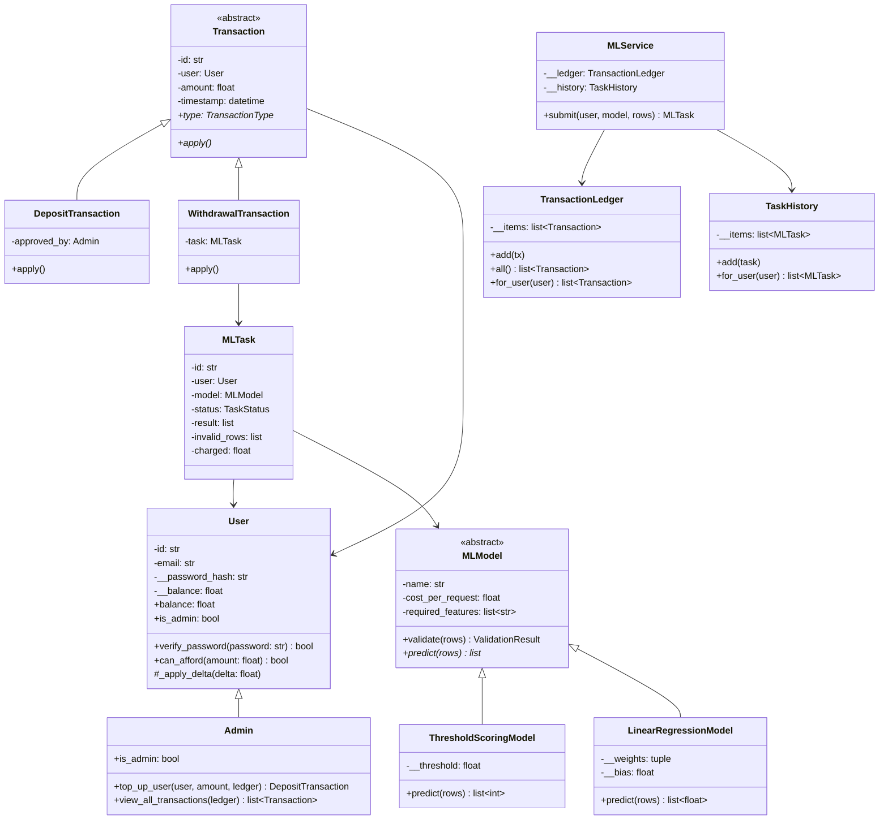

# ML-сервис с биллингом — Этап 1: объектная модель

Объектная модель личного кабинета ML-сервиса: пользователи, баланс в условных
кредитах, транзакции, ML-модели, задачи предсказания и их история.

## Структура

- `domain.py` — объектная модель сервиса
- `demo.py` — демо-сценарий: регистрация, пополнение, запрос с валидацией, списание, история

## Запуск

```bash
python demo.py
```

Зависимостей нет, требуется Python 3.10+.

## Сущности

| Класс | Назначение |
|---|---|
| `User` / `Admin` | Пользователь и администратор (наследование). Баланс и хэш пароля — приватные поля |
| `Transaction` (ABC) → `DepositTransaction`, `WithdrawalTransaction` | Пополнение и списание; полиморфный `apply()` |
| `TransactionLedger` | История транзакций, выборка по пользователю |
| `MLModel` (ABC) → `ThresholdScoringModel`, `LinearRegressionModel` | Модели с единым интерфейсом `validate()` / `predict()` и стоимостью запроса |
| `MLTask`, `TaskHistory` | Задача для модели со статусом, результатом, ошибочными строками и суммой списания |
| `MLService` | Оркестратор: проверка баланса → валидация → предикт → списание при успехе |

## Диаграмма классов



## Принципы ООП

**Инкапсуляция.** Баланс (`User.__balance`) и хэш пароля — приватные; изменение
баланса возможно только через транзакции (`Transaction.apply()` →
`User._apply_delta()`), напрямую выставить баланс нельзя. Внутренние списки
историй закрыты, наружу отдаются копии. Состояние `MLTask` меняется только
методами оркестратора.

**Наследование.** `Admin` расширяет `User` (пополнение баланса другим
пользователям, просмотр всех транзакций); конкретные транзакции и модели
расширяют абстрактные `Transaction` и `MLModel`.

**Полиморфизм.** `MLService` вызывает `model.predict()` и `tx.apply()`, не зная
конкретного класса; `Admin.is_admin` переопределяет свойство базового класса.

## Бизнес-правила

- Запрос отклоняется при недостаточном балансе (`InsufficientBalanceError`) —
  проверка до выполнения.
- Ошибочные строки выборки возвращаются пользователю, предсказание выполняется
  над валидными.
- Кредиты списываются только при успешном выполнении предсказания.
